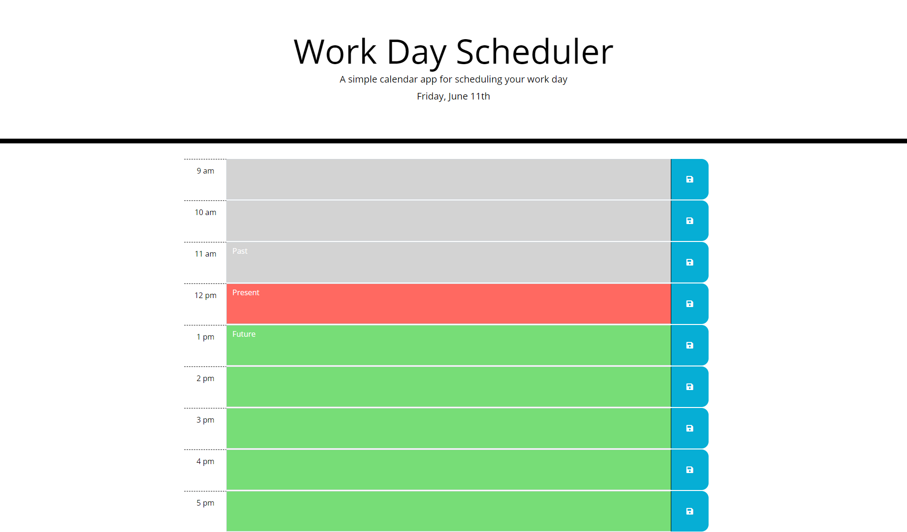

# day-planner-2021
## Description
This project allowed me to implement new web based APIs which greatly increased the efficacy and professionaism of my work. Making a weblayout was near effortless which allowed me to focus on the javascript portion and using jquery. In programming this project I found that jquery was a great way of simplifying javascript logic through the use of helpful methods and easier DOM traversal. After using jquery, I do not think I will ever use base javascript again. Additionally although outdated, the moment API was a great intro into looking through new documentation for useful methods. Although I was unable to get a few of the methods working due to the strict syntax constraints, the API was still useful. I hope in the future I can return to this project and implement more functionality or update the API used to get the current time to a more modern one.
## Table of Contents (Optional)
- [Installation](#installation)
- [Usage](#usage)
- [Credits](#credits)
- [License](#license)
## Installation
Deployed Link: https://randy-chou.github.io/day-planner-2021/
## Usage
Webpage:

## Credits
N/A
## License
N/A
## Badges
N/A
## Features
Below the title of the object, the current date and time is displayed and updated every second. Based on what time it is, each time section changes color: grey if the hour is in the past, red for the current our, and green time blocks in the future. The time blocks are also text areas where you can add events or tasks that you need to do at each working hour of the day. You can save these entries by clicking button to the right of each textbox to put the content into local storage where it will be loaded onto future planner instances unless deleted by removing the entry and saving the empty textbox. 
## How to Contribute
N/A
## Tests
N/A